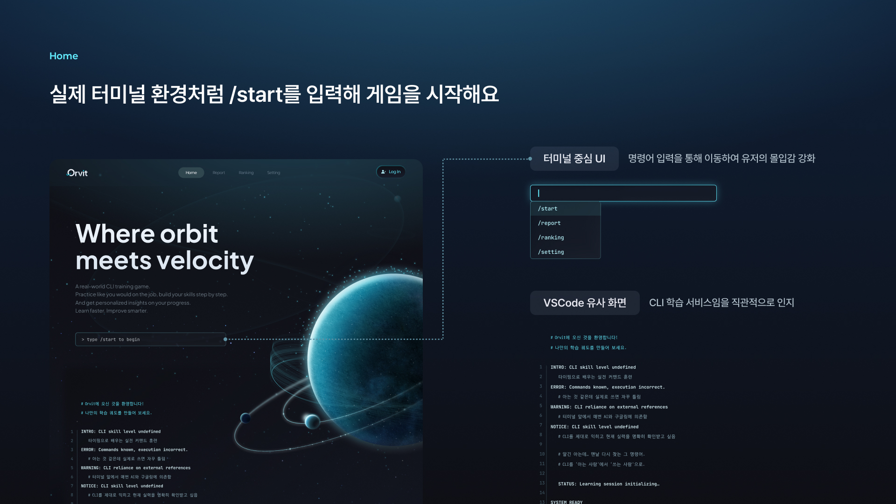
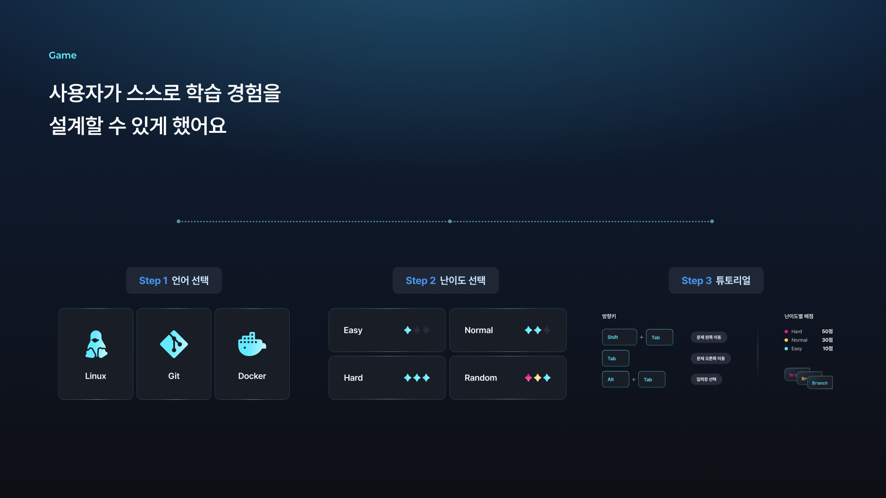
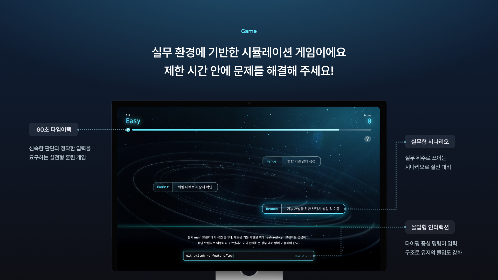
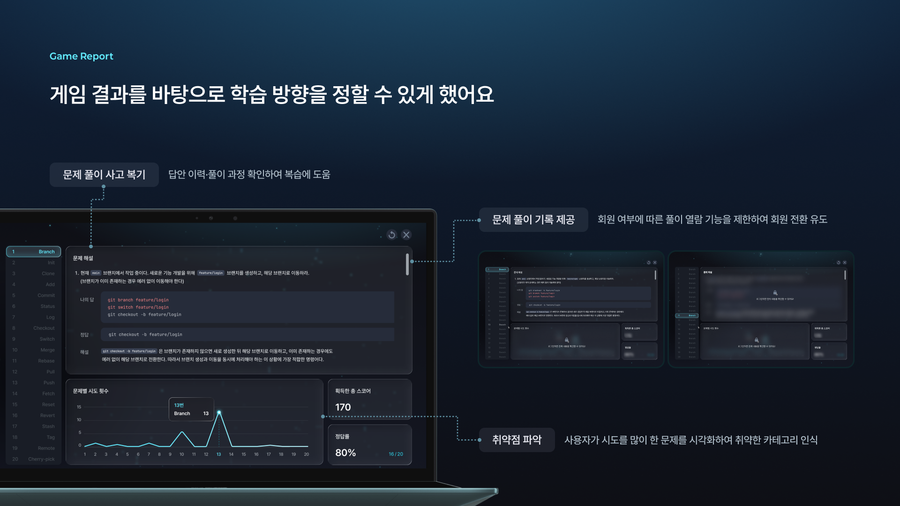
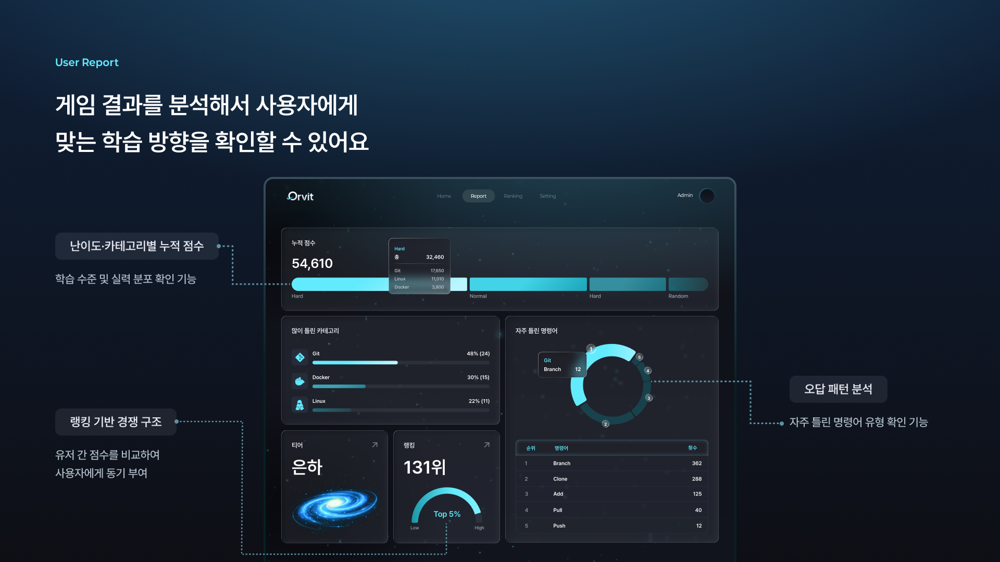
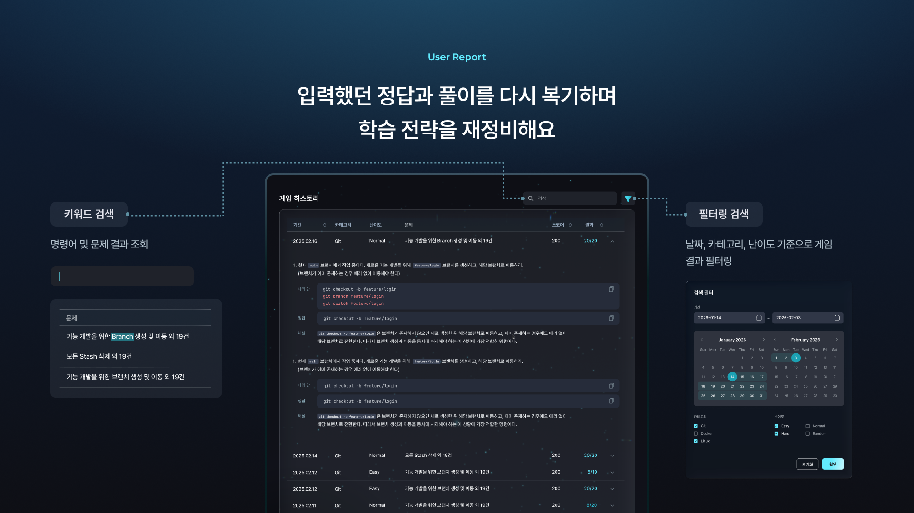
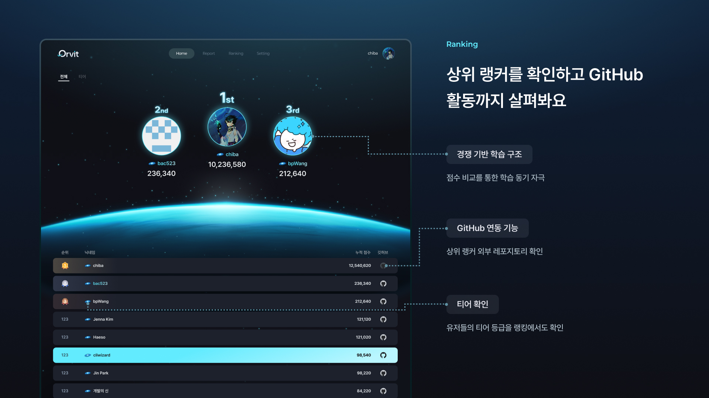
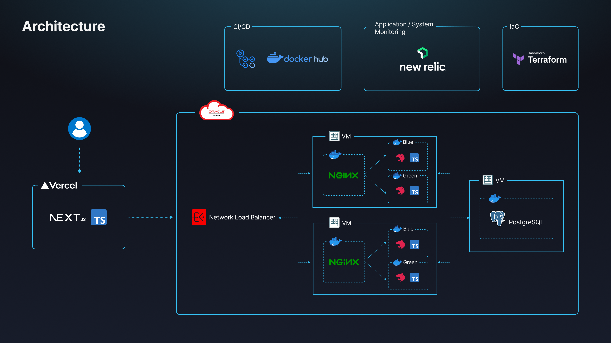
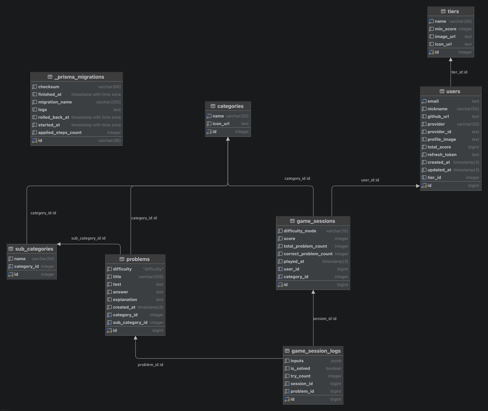

# Orvit 백엔드 서비스

> **Orvit**은 Git/Linux/Docker CLI 명령어를 퀴즈 형식으로 학습할 수 있는 교육용 게임 플랫폼의 백엔드 서비스입니다.
> OAuth 소셜 로그인, 실시간 퀴즈 스트리밍(SSE), 게임 분석/통계, 티어 랭킹 시스템을 제공합니다.









---

## 기술 스택

| 분류                | 기술                                          |
| ------------------- | --------------------------------------------- |
| **Framework**       | NestJS v11, TypeScript v5.7                   |
| **Database / ORM**  | PostgreSQL, Prisma v6                         |
| **Authentication**  | Passport.js (Google OAuth, GitHub OAuth), JWT |
| **Real-time**       | Server-Sent Events (SSE)                      |
| **Transaction**     | nestjs-cls/transactional + Prisma Adapter     |
| **Validation**      | class-validator, class-transformer, Joi       |
| **API Docs**        | Swagger (nestjs/swagger)                      |
| **Monitoring**      | New Relic APM                                 |
| **CI/CD**           | GitHub Actions, Docker Hub                    |
| **CSP**             | Oracle Cloud Infrastructure (OCI)             |
| **IaC**             | Terraform                                     |
| **Test**            | Jest, Supertest, Testcontainers               |
| **Runtime**         | Node.js 24                                    |
| **Package Manager** | pnpm                                          |
| **Code Quality**    | ESLint, Prettier, Husky, lint-staged          |

---

## 인프라 구조



- **Frontend**: Vercel에 배포된 Next.js(TypeScript) 클라이언트
- **Application Server**: NGINX 리버스 프록시 + Blue-Green 컨테이너 무중단 배포
- **Database**: 별도 VM에서 Private 하게 운영되는 PostgreSQL
- **CI/CD**: GitHub Actions -> Docker Hub -> OCI VM 자동 배포
- **Monitoring**: Newrelic
- **IaC**: Terraform을 통한 인프라 프로비저닝

---

## ERD Diagram



---

## Backend Convention

> - Backend Coding Convention: [🔗 link](./docs/ground-rule.md)

2인 백엔드 팀이 일관된 코드베이스를 유지하기 위해 코딩 컨벤션을 정의했습니다.
협업 시 코드 스타일이 제각각이면 리뷰와 디버깅에 불필요한 비용이 발생하기 때문에,
명확한 규칙을 사전에 합의하는 것이 중요하다고 판단했습니다.

Google TypeScript Style Guide를 기반으로 네이밍·파일명·폴더 구조 규칙을 통일했으며,
Layered + Clean Architecture를 적용해 계층별 역할과 의존성 방향을 명확히 분리했습니다.
Git은 git-flow 브랜치 전략을 따르고, 커밋 메시지는 `태그: 메시지` 형식(feat, fix, refactor 등)으로 규격화했습니다.

이를 통해 서로의 코드를 빠르게 파악하고, 리뷰 비용을 줄이며,
장기적으로 유지보수하기 좋은 구조를 갖추는 것을 목표로 했습니다.

---

## 프로젝트 아키텍처

```text
src/
├── auth/                  # 인증 모듈 (OAuth, JWT)
│   ├── application/       #   - AuthFacade, AuthService
│   ├── domain/            #   - 비즈니스 규칙
│   └── presentation/      #   - Controller, Guard, Strategy, DTO
├── users/                 # 유저 모듈
│   ├── application/       #   - UsersFacade, UsersService
│   ├── domain/            #   - 엔티티, 인터페이스
│   ├── infrastructure/    #   - Repository 구현체
│   └── presentation/      #   - Controller, DTO
├── games/                 # 게임 모듈 (핵심 도메인)
│   ├── application/       #   - GameFacade, GameSessionService, GameStreamService, GameAnalyticsService
│   ├── domain/            #   - Problem, Category, GameSession, GameSessionLog
│   ├── infrastructure/    #   - Repository 구현체
│   └── presentation/      #   - Controller, DTO, Decorator
├── tiers/                 # 티어/랭킹 모듈
│   ├── application/       #   - TiersService
│   ├── domain/            #   - Tier 엔티티
│   ├── infrastructure/    #   - Repository 구현체
│   └── presentation/      #   - Controller, DTO
├── common/                # 공통 모듈
│   ├── exceptions/        #   - 커스텀 예외
│   ├── filters/           #   - 전역 예외 필터
│   ├── interceptors/      #   - 응답 인터셉터
│   └── decorators/        #   - 커스텀 데코레이터
├── config/                # 환경 설정
├── prisma/                # Prisma ORM 모듈
└── main.ts                # 애플리케이션 진입점
```

각 도메인 모듈은 **Clean Layered Architecture(DDD)** 패턴을 따르며, `application` / `domain` / `infrastructure` / `presentation` 레이어로 분리되어 있습니다.

### 적용된 설계 패턴

- **Facade** - 여러 서비스를 조합하는 오케스트레이션 레이어 (GameFacade, UsersFacade, AuthFacade)
- **Repository** - 데이터 접근 추상화 (인터페이스 + 구현체 분리)
- **Strategy** - Passport 인증 전략 (JWT, Google, GitHub)
- **Transactional** - nestjs-cls를 활용한 선언적 트랜잭션 관리

---

## 주요 기능

### 게임 (Game)

| 이슈                                                                    | 기능                                        |
| ----------------------------------------------------------------------- | ------------------------------------------- |
| [#6](https://github.com/dnd-side-project/dnd-14th-6-backend/issues/6)   | 게임 옵션 선택 API                          |
| [#13](https://github.com/dnd-side-project/dnd-14th-6-backend/issues/13) | 게임 진행 API (SSE 실시간 퀴즈 스트리밍)    |
| [#16](https://github.com/dnd-side-project/dnd-14th-6-backend/issues/16) | 게임 저장 API                               |
| [#17](https://github.com/dnd-side-project/dnd-14th-6-backend/issues/17) | 게임 리포트 결과 조회 API                   |
| [#24](https://github.com/dnd-side-project/dnd-14th-6-backend/issues/24) | 게임 세션 히스토리 목록 조회 API            |
| [#26](https://github.com/dnd-side-project/dnd-14th-6-backend/issues/26) | 게임 API Swagger 리팩터링                   |
| [#51](https://github.com/dnd-side-project/dnd-14th-6-backend/issues/51) | 게임 저장/결과 리포트 API 인증 가드 적용    |
| [#62](https://github.com/dnd-side-project/dnd-14th-6-backend/issues/62) | 게임 세션 저장 시 유저 티어 업데이트        |
| [#63](https://github.com/dnd-side-project/dnd-14th-6-backend/issues/63) | 게임 세션 저장 API 에러 수정                |
| [#66](https://github.com/dnd-side-project/dnd-14th-6-backend/issues/66) | 비회원의 회원 게임 결과 접근 제한 버그 수정 |
| [#68](https://github.com/dnd-side-project/dnd-14th-6-backend/issues/68) | 게임 스트림 SSE pending 이슈 해결           |
| [#74](https://github.com/dnd-side-project/dnd-14th-6-backend/issues/74) | 퀴즈 생성 속도 조정                         |

### 인증 (Auth)

| 이슈                                                                    | 기능                                                |
| ----------------------------------------------------------------------- | --------------------------------------------------- |
| [#49](https://github.com/dnd-side-project/dnd-14th-6-backend/issues/49) | 소셜 로그인 callback URL 지정 방식 수정             |
| [#54](https://github.com/dnd-side-project/dnd-14th-6-backend/issues/54) | 토큰 응답 쿠키 SameSite 속성 변경                   |
| [#57](https://github.com/dnd-side-project/dnd-14th-6-backend/issues/57) | 로그인 토큰 반환을 Authorization Code 방식으로 수정 |
| [#72](https://github.com/dnd-side-project/dnd-14th-6-backend/issues/72) | 프론트엔드 운영 도메인 CORS 추가                    |

### 유저 / 랭킹 (User & Ranking)

| 이슈                                                                    | 기능                                                     |
| ----------------------------------------------------------------------- | -------------------------------------------------------- |
| [#11](https://github.com/dnd-side-project/dnd-14th-6-backend/issues/11) | 전체 티어 목록 조회 API                                  |
| [#12](https://github.com/dnd-side-project/dnd-14th-6-backend/issues/12) | 전체 유저 랭킹 조회 API                                  |
| [#18](https://github.com/dnd-side-project/dnd-14th-6-backend/issues/18) | 유저 스탯(누적 점수, 현재 티어, 랭킹) 조회 API           |
| [#21](https://github.com/dnd-side-project/dnd-14th-6-backend/issues/21) | 유저 분석(많이 틀린 카테고리, 자주 틀린 명령어) 조회 API |
| [#53](https://github.com/dnd-side-project/dnd-14th-6-backend/issues/53) | 분석/스탯 조회 로직 Facade 패턴 리팩터링                 |
| [#69](https://github.com/dnd-side-project/dnd-14th-6-backend/issues/69) | 스탯 조회 시 백분위 응답 추가                            |

### 공통 (Common)

| 이슈                                                                  | 기능                             |
| --------------------------------------------------------------------- | -------------------------------- |
| [#4](https://github.com/dnd-side-project/dnd-14th-6-backend/issues/4) | ESLint 설정 이슈 해결            |
| [#7](https://github.com/dnd-side-project/dnd-14th-6-backend/issues/7) | ErrorExceptionFilter 공통 핸들링 |

### 테스트

모든 API 기능에 대해 **단위 테스트(Unit Test)** 와 **E2E 테스트** 를 작성하여 안정성을 확보했습니다.
E2E 테스트는 Testcontainers로 실제 PostgreSQL 컨테이너를 띄워 API 요청-응답 전체 흐름을 검증합니다.

---

## 팀원 및 역할

<!-- markdownlint-disable MD033 -->

|                                                |  이름  |                      GitHub                      | 담당                                                                                                                                                                                                                                                                                                                                                                                                                                                                                                                                                                                                                |
| :--------------------------------------------: | :----: | :----------------------------------------------: | ------------------------------------------------------------------------------------------------------------------------------------------------------------------------------------------------------------------------------------------------------------------------------------------------------------------------------------------------------------------------------------------------------------------------------------------------------------------------------------------------------------------------------------------------------------------------------------------------------------------- |
|       | 채정아 |      [@jokj624](https://github.com/jokj624)      | - CI/CD 파이프라인 구축 (GitHub Actions, Dockerfile, Docker Hub, OCI 배포 자동화) <br> - 소셜 로그인 구현 (Google OAuth, GitHub OAuth) 및 Authorization Code 토큰 발급 방식 전환 <br> - JWT 인증/갱신 로직, 쿠키 SameSite 속성 관리 <br> - 유저 스탯 조회 API (누적 점수, 티어, 랭킹, 백분위) <br> - 유저 분석 조회 API (많이 틀린 카테고리, 자주 틀린 명령어) <br> - 전체 티어 목록 / 전체 유저 랭킹 조회 API <br> - 게임 세션 히스토리 조회 API <br> - Game Analytics 서비스 분리 리팩터링 <br> - 공통 Exception Filter 핸들링 <br> - 모니터링 연동 (New Relic, Sentry) <br> - Terraform을 활용한 IaC 인프라 관리 |
|  | 최은강 | [@loveAlakazam](https://github.com/loveAlakazam) | - 프로젝트 초기 환경 구축 (Husky, ESLint, Prettier, Prisma, Swagger, DB 스키마 설계) <br> - 게임 옵션 선택 / 게임 진행(SSE 실시간 스트리밍) / 게임 저장 / 게임 결과 리포트 조회 API <br> - 게임 세션 저장 후 유저 누적 점수 증분 업데이트 및 티어 승급 로직 <br> - 비회원/회원 게임 결과 접근 권한 제어 <br> - SSE 스트림 pending 이슈 해결 (x-accel-buffering 헤더) <br> - 퀴즈 출제 타이밍 조정 <br> - nestjs-cls/transactional 트랜잭션 관리 도입 <br> - Response Interceptor, Swagger 설정                                                                                                                      |

<!-- markdownlint-enable MD033 -->
