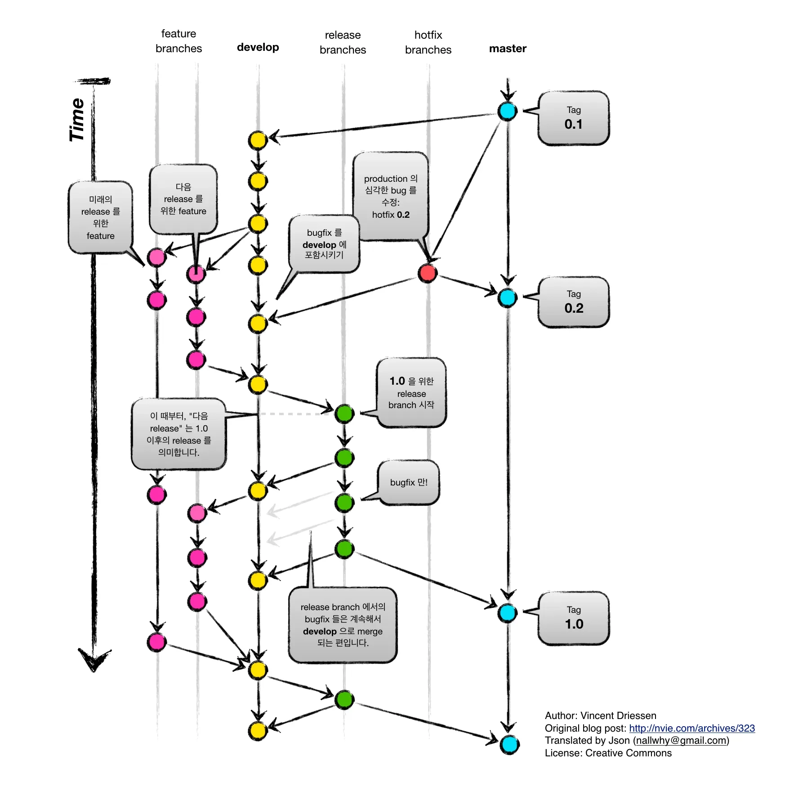

# Coding Convention

## TS Style Guide

- <https://google.github.io/styleguide/tsguide.html>
- 전반적인 TypeScript 스타일 가이드는 **Google 가이드**를 따릅니다.

## Naming Convention

1. 약어를 지양하고 길어지더라도 **직관적인 이름**을 사용합니다.
2. 역할에 따라 정해진 규칙의 표기법을 따릅니다. (표 참고)

| 역할           | 표기법                                                     |
| -------------- | ---------------------------------------------------------- |
| UpperCamelCase | 클래스, 인터페이스, 타입, enum, 데코레이터, 타입 파라미터  |
| lowerCamelCase | 일반 변수, 파라미터, 함수이름, 메소드, property, 모듈 등등 |
| CONSTANT_CASE  | 전역 constant 변수, enum values 를 포함한 변수             |

<br>

3. 파일명 컨벤션

- **`<이름>.파일유형.ts` 형태**를 사용합니다.
  - e.g. `<entity>.dto.ts` / `<entity>.controller.ts` / `<entity>.service.ts`
- entity가 단어가 여러개 결합된 경우 kebab-case 로 사용합니다.
  - e.g. `order-item.service.ts`

<br>

4. 폴더명 컨벤션

- 기본적으로 복수형을 사용하나 복수형으로 만들기 어려운 경우 단수로 사용합니다.
- e.g. `common`, `auth` 와 같은 폴더는 단수형으로 사용

<br>

## Formating & Linter

- 일관된 코드 포맷팅을 위해 prettier를 사용합니다.

```jsx
{
  "singleQuote": true,
  "trailingComma": "all",
  "tabWidth": 2,
  "semi": true,
  "printWidth": 100
}
```

<br>

- 일관된 코드 형태 작성을 위해 `eslint`를 사용합니다.
  - <https://typescript-eslint.io/>
  - Nest.js에 설정된 Recommend rule을 기본으로 사용합니다.

<br>

## 프로젝트 아키텍쳐 구조 - Layered + Clean Architecture

```bash
/src/feature-name
 ├── /presentation      # [Layer 1] Delivery Mechanism (HTTP/API)
 │    ├── feature.controller.ts
 │    └── /dto          # Request/Response DTOs
 │         └── {function-name}.dto.ts
 │
 ├── /application       # [Layer 2] Use Case Orchestration
 │    └── feature.service.ts
 │
 ├── /domain            # [Layer 3] Core Business Logic (Pure)
 │    ├── feature.entity.ts
 │    ├── feature.business-rule.ts
 │    └── feature.repository.interface.ts
 │
 ├── /infrastructure    # [Layer 4] Technical Implementation
 │    └── feature.repository.ts
 │
 └── feature.module.ts  # Nest.js DI Wiring
```

|  계층 (Layer)  |      폴더명       | 역할                                                                                            |       의존성 방향        |
| :------------: | :---------------: | :---------------------------------------------------------------------------------------------- | :----------------------: |
|  Presentation  |  `/presentation`  | - 입/출력 담당. <br> - HTTP 요청 파싱, DTO 유효성 검증(Validation), 응답 포맷팅                 | Application, Domain 의존 |
|  Application   |  `/application`   | - 진행담당. <br> - 도메인 객체를 가져와서 일을 시키고, 트랜잭션을 관리함. (순수 로직 X, 흐름 O) |       Domain 의존        |
|     Domain     |     `/domain`     | - 규칙담당. <br> - 핵심 비즈니스 로직, 엔티티 상태 변경, 인터페이스 정의                        |   의존성 없음 (독립적)   |
| Infrastructure | `/infrastructure` | - 기술 담당. <br> - DB 접근, 외부 API 호출 등 실제 기술 구현.                                   | Domain 의존 (implements) |

<br>

- Repository DI token

  DI token 이름 컨벤션 = `도메인(단수)_REPOSITORY`
  - 예시
    - 티어 -> `TIER_REPOSITORY`
    - 게임 -> `GAME_REPOSITORY`
    - 유저 -> `USER_REPOSITORY`

- Repository 구현체 네이밍
  - `<도메인명>RepositoryImpl`

<br>

## 기능 단위 개발 컨벤션

- service, controller 단위테스트 케이스 만들기
- 함수기능 설명 ts-doc 나타내기

```tsx
export interface IGameRepository {
  /**
   * @description 모든 카테고리 목록을 조회
   */
  getCategories(): Promise<GameCategory[]>;
}
```

- 외부모듈을 불러올 경우에만 pathAlias 활용해서 임포트문 표현하기
  - (예시) GamesModule
    - 같은 도메인 모듈에 내 파일 호출시 상대경로로 임포트

            (e.g. `GamesService`, `GamesController`, `GAME_REPOSITORY`, `GameRepositoryImpl`)

    - 다른 도메인 모듈에 있는 대상 호출시 pathAlias 로 호출 (e.g. `PrismaModule`)

      ```tsx
      import { Module } from '@nestjs/common';

      import { PrismaModule } from '@prisma/prisma.module';

      import { GamesService } from './application/games.service';
      import { GAME_REPOSITORY } from './domain/games.repository.interface';
      import { GameRepositoryImpl } from './infrastructure/games.repository';
      import { GamesController } from './presentation/games.controller';

      @Module({
        imports: [PrismaModule],
        providers: [
          GamesService,
          {
            provide: GAME_REPOSITORY,
            useClass: GameRepositoryImpl,
          },
        ],
        controllers: [GamesController],
        exports: [GamesService],
      })
      export class GamesModule {}
      ```

<br>

## 초기 테스트 데이터셋 Seeding CLI 명령어 방법

- seed파일 1개 seeding할 경우

  (e.g) category.seed.ts 파일을 seeding 할경우

  ```
  npx prisma db seed -- category
  ```

- seed파일 전체 seeding 할경우
  - 방법1 - package.json에 명시된 seed 명령어

    ```
    pnpm run seed
    ```

  - 방법2 - npx 로 할 경우

    ```
    npx prisma db seed
    ```

<br>

# Git Convention

> 커밋 형태는 "태그: 커밋 메시지” 형태로 통일합니다. (e.g. `"feat: 로그인 API 구현"`)
>
> 현재 커밋에 포함된 내용과 태그가 일치하도록 알맞은 태그를 선택합니다.

<br>

| 태그     | 설명                                         |
| -------- | -------------------------------------------- |
| fix      | (버그발생 확인후 ) 버그수정                  |
| refactor | 코드 리팩터링                                |
| docs     | 리드미 작성 & <br> 리드미에 관련 이미지 추가 |
| chore    | 패키지 설치, 기능단위가 아닌 작업            |
| init     | 프로젝트 초기셋팅                            |
| hotfix   | 이슈, QA에서 급한 버그수정                   |
| remove   | 불필요 코드/파일 삭제                        |
| rename   | 파일 이름 변경                               |
| test     | 테스트파일 관련 작업                         |

<br>

## Git Branch Strategy

> 기본적으로 git-flow 브랜치 전략을 따릅니다.
>
> 👉 git-flow 브랜치 전략을 보다 쉽게 사용하기 위해 git-flow 명령어를 설치해 사용합니다.

```bash
macOS: brew install git-flow-avh
ubuntu: sudo apt-get install git-flow -y
```



1. `main`
   1. 프로덕션 환경과 일치하는 브랜치입니다.
2. `develop`
   1. 현재 개발 환경과 일치하는 브랜치입니다.
3. `feature`
   1. 기능 구현을 위한 feature 브랜치입니다.
   2. 개발 단위에 맞게 브랜치를 가져갑니다.
   3. `feature/{issue_number}` 로 통일해 관리합니다.
4. `hotfix`
   1. 프로덕션 환경에 긴급히 수정해야 할 일이 있을 때 사용하는 브랜치입니다.
   2. 현재 프로덕션 환경 master에서 분기된 브랜치입니다.
5. `release`
   1. 개발 환경에서 프로덕션 환경으로 배포하기 위해 사용하는 릴리즈용 브랜치입니다.

<br>

## PR Code Review Process

1. PR 생성
2. AI Agent에게 코드리뷰 요청 (e.g. github-copilot, Genmini, coderabbitai...)
3. (2단계) 피드백 반영
4. 휴먼리뷰
5. (4단계) 피드백 반영
6. 이상 없거나 더이상의 피드백이 없다면 Merge

<br>

## 프로젝트 런칭전 관리

> git-flow 전략을 따르되 프로젝트 실제 런칭 전까지는
> main/hotfix/release 없이 develop, feature 브랜치를 사용합니다.

- `main` 브랜치: 서비스 런칭 및 릴리즈
- `develop`: 개발환경
  - 데모데이 이전 default 브랜치
  - 데모데이 이전 개발단계에서 활용 - PR 머지 브랜치에 해당.
